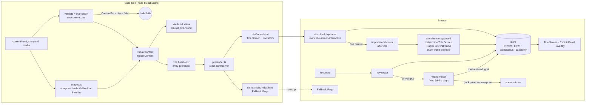

# Plan: increment-1

Status: approved, 2026-10-10 (commit `plan: approve increment-1`): the Owner's plan-mode review
(guide §4.2 step 1) and the independent review (§4.2 step 3, two passes) are folded in; Q1–Q4
answered. Ticket: #21. Spec: `docs/spec/increment-1.md`, approved 2026-10-08 (commit 408c7f8).
`/to-tickets` cuts §11 into tracker issues in the PR of that commit.

Vocabulary is `GLOSSARY.md`; terms in capitals are defined there. Spec words that the glossary does
not define yet (the Title Screen's *one line*, the *way-in control*, the *key legend*, the World's
*overlay*) are used as the spec writes them; a glossary addition is a hand-off (§13).

## Context

The spec fixes what increment-1 is: Title Screen, Hub, one Path, one Zone with Goal and Banner, the
Puck under Direct Drive with the Follow Camera and Reset, one Exhibit, Bio, Contact, two Announcer
captions, the Fallback Page, the Exhibit Panel from the Goal and from the Title Screen list. Phase 0b
left the toolchain the plan builds on: `make verify` (Prettier, ESLint, tsc, shellcheck, shell tests,
Vitest with a coverage ratchet), the two test seams (Playwright against `dist/` in Chromium, Firefox
headed under Xvfb and WebKit with axe; Rapier stepped under Node), the CI gates `lint`, `test`,
`build`, `e2e`, `perf` (Lighthouse budget from `perf/budget.json`), `sast`, `deps`, `gitleaks`,
`spec-freeze`, `ai-review`, Renovate, Vercel previews per PR with production held by Deployment
Checks, and the `.claude` configuration. `src/` holds a skeleton (`App.tsx` with one mesh and the
provisional `world-playable` mark).

This plan decides the how: module boundaries, the four stack decisions the ADRs do not cover yet,
the content schema the Owner's Exhibit-1 text is waiting for, the contracts between modules, the
test per acceptance criterion, what CI measures, the headers the site sends, the risks in order and
the tickets that retire them. The Owner's budget is about 4 hours a week; the increment is live
within about 12 weeks; touch steering is last and optional.

## 1. Scope

**Spec sections covered**: every user story US-1 … US-28 and every acceptance criterion AC-1.1 …
AC-28.3 (the mapping is §6), the Non-functional requirements, the Data & privacy classification,
the Implementation decisions, the Testing decisions and the Constraints. Nothing in the spec is left
to a later plan.

**Inputs the plan fixes that the spec left to it**: the pre-rendering mechanism (§3, ADR 0010); the
instrument for "World playable" and the instrument for "Title Screen interactive" (§7); the
response headers (§8, ADR 0012); the Fallback Page path **`/exhibits`** (its anchors `/exhibits#<id>`
are the shareable per-Exhibit addresses); the reference laptop for AC-23.1: **HP EliteBook 840 G10,
Intel Core i5/i7-13xxU with Iris Xe, Windows 11, current Edge, on mains power in Balanced mode**
(measurements on the Owner's ZBook Ultra G1a are supplementary and never the recorded value).
Hosting, domain, LICENSE and the CI profile were settled in Phase 0b (ADR 0006, LICENSE,
`perf/budget.json`).

**Non-goals carried over from the spec, unchanged**: touch input (deferred; see §11 for the optional
last ticket and its precondition), the other four Exhibits, any Challenge, the "visit in the World"
action from a Panel opened on the Title Screen, the CV, audio, persistence, analytics, any backend,
bilingual content, lazy-loading of Zones; refused: gamepad, any stack other than ADR 0003,
third-party embeds or scripts, a LinkedIn link, anything that gates an Exhibit.

**Scope guard** (spec, Constraints): if time runs short, deferrable by an `amend:` commit in this
order: AC-27.1 (ship one optimised size), AC-22.2, AC-17.3's viewport sizing.

**Owner dependencies, due before the ticket that consumes them** (§11): Exhibit-1 content in the §4
schema (summary, 1–3 images with alternative text, optional video with poster, "what I'd do
differently"), the Bio, the Title Screen's one line, the two Announcer captions, a social preview
image (falls back to the first image of Exhibit-1).

## 2. Architecture

A static site of two HTML documents and two script chunks. No backend, no router, no server-side
code at runtime; everything dynamic happens at build time or in the Visitor's browser.

| document | built from | needs script? |
|---|---|---|
| `/` (`dist/index.html`) | pre-rendered Title Screen + the `site` chunk, which hydrates it and lazy-loads the `world` chunk | no for its links; yes for the Panel and the World |
| `/exhibits` (`dist/exhibits/index.html`) | pre-rendered Fallback Page | no; it carries no script at all |

### Module boundaries

| module | directory | owns | must not import |
|---|---|---|---|
| **content** | `content/` (files), `src/content/` (schema, types, pure validation), `build/content-plugin.ts`, `build/images.ts` | the Exhibit, Bio and site files; the typed `Content` the site renders; validation that fails the build with file and field; image variants | React, three, Rapier |
| **site** (HTML surfaces) | `src/site/` | Title Screen, Fallback Page, Exhibit Panel, Contact line, capability hints, the World's HTML overlay (caption, Reset control, key legend) as React components rendered at build and hydrated in the browser | three, Rapier, the World model |
| **app** (state and wiring) | `src/app/` | the store (`useSyncExternalStore`), the screen state machine, key routing, focus management, capability detection, the World preload and entry policy, the failure boundary | three, Rapier |
| **world / model** | `src/world/model/` | the World layout from content (Rinks, boards, openings, Goal volumes, caption places, Banner text), the Rapier world, Direct Drive, the fixed-timestep step, Reset, the Follow Camera pose as a function of the Puck, events (Zone entered, Goal, Goal left) | React, three, the DOM |
| **world / input** | `src/world/input/` | physical-key state (`KeyboardEvent.code`) → `DriveInput`; the R, Escape, Enter and Space bindings | three, Rapier |
| **world / scene** | `src/world/scene/` | React Three Fiber components that mirror the model each frame: ice, boards, Puck, Goal, Banner (a canvas texture, no font download), camera rig; the `world-playable` mark | the content files directly (gets `WorldLayout` from the model) |
| **perf** | `src/perf/` | the two user-timing marks (existing module) | anything |
| **build** | `build/` | `build.ts` (orchestrator: client build, SSR build, prerender), `prerender.ts`, the content plugin, image pipeline | browser APIs |
| entries | `src/main.tsx` (hydrate `/`), `src/entry-prerender.tsx` (render both documents to strings) | | |

Physics runs **inside the model**, not inside React: `@react-three/rapier` is not used (ADR 0009; see
§3 for the ADR 0003 wording this supersedes). The scene reads positions; it never steps the world.

### Data flow



**What runs where.** Build time: content validation, Markdown to HTML, image variants, both
documents' HTML, chunking (`site` = React + site + app + content JSON; `world` = three, R3F, Rapier,
model, scene). Browser, before hydration: links only (Fallback link, Contact links, Exhibit list
entries point at `/exhibits#<id>`). Browser, after hydration: the Panel from the list, the way-in
control, capability hints, then the World. Nothing runs at request time: Vercel serves files.

**Entry and preload policy** (spec, Architecture). After the `title-screen-interactive` mark, unless
a coarse pointer was detected, the app imports the `world` chunk in an idle callback; when it
arrives the World mounts **paused and behind the opaque Title Screen**, initialises Rapier, renders
one frame (`frameloop="demand"`) and records `world-playable`. Enter or Space (or the way-in
control) hides the Title Screen, unpauses, focuses the World container. Enter during loading sets
`entering` and the switch happens on readiness without a second press (AC-4.2). Escape in the World
shows the Title Screen over the paused World; Enter resumes it unchanged (AC-6.x). This is also why
the perf gate can measure "World playable" from a plain navigation (§7).

**Routing.** None in the browser. Two documents, anchors on the Fallback Page, the Panel is state
(no deep link, per spec). `vercel.json` already has `cleanUrls: true, trailingSlash: false`;
`vite preview` (used by e2e and perf) serves `exhibits/index.html` at `/exhibits` as well; the first
ticket that emits it verifies both.

## 3. Stack decisions

| decision | where recorded |
|---|---|
| TypeScript strict, React 19, React Three Fiber 9, three, Rapier (`@dimforge/rapier3d-compat`), Vite 8, Vitest, Playwright, ESLint, Prettier, pnpm, Node 24 | ADR 0003; Phase 0b plan decisions 1–2, 12 |
| Root and Fallback Page pre-rendered, World hydrates on top | ADR 0004 (mechanism: ADR 0010 below) |
| Puck feel: Standard preset values, fixed-yaw Follow Camera | ADR 0005 |
| Hosting Vercel, `vercel.json` only, previews per PR, production held by Deployment Checks | ADR 0006 |
| Renovate grouped patch automerge | ADR 0007 |
| Hooks, clean worktree, shell gates | ADR 0008 |
| **World model owns Rapier and runs outside React; R3F mirrors it; app state in a small `useSyncExternalStore` store** | **ADR 0009 (new stub)** |
| **Pre-rendering: Vite SSR build of two routes rendered with `react-dom/server`; the Title Screen hydrates with `hydrateRoot`; no router and no SSG framework** | **ADR 0010 (new stub)** |
| **Content pipeline: Markdown + YAML front matter under `content/`, zod schema, a Vite plugin exposing `virtual:content`, sharp image variants at build** | **ADR 0011 (new stub)** |
| **Response headers: CSP and companions in `vercel.json`, mirrored into `vite preview` from the same file** | **ADR 0012 (new stub)** |

**ADR 0003 wording superseded by ADR 0009.** ADR 0003 says "Rapier (WebAssembly, via its R3F
binding)". The spec requires a World model steppable under Node without a renderer (Implementation
decisions, Architecture; seam 2), which `@react-three/rapier`'s `<Physics>` tree cannot give without
a second copy of the world. ADR 0009 supersedes that phrase only; the rest of ADR 0003 stands
(Phase 0b decision 12 already left the binding out). `@react-three/drei` is not needed in
increment-1 (the Banner is a canvas texture, keys are a plain listener); it arrives with the first
component that uses it, as decision 12 says.

**Dependencies this plan adds, each in the ticket that first uses it, listed in that PR body:**

| package | license | reason | ticket |
|---|---|---|---|
| `zod` 4 | MIT | content schema with error paths for AC-26.2 | T3 |
| `yaml` 2 | ISC | front matter and `site.yaml` parsing (no `gray-matter`: unmaintained, bundles js-yaml 3) | T3 |
| `markdown-it` | MIT | Markdown to HTML at build; `html: false` (its default) escapes raw HTML, proven by a build fixture; CSP forbids inline script anyway | T3 |
| `sharp` | Apache-2.0 | image variants at build (prebuilt binaries via optional platform packages; §12 Q4 checks pnpm 10's build-script policy) | T3 |
| `@types/markdown-it` (dev) | MIT | types for `markdown-it`, which ships none | T3 |

T0, T1 and T2 add no dependency. No runtime dependency beyond those already pinned. Versions follow
the CLAUDE.md rule (newest the whole toolchain's peer ranges accept, exact in `package.json`).

**Rejected**: Astro or Vike for pre-rendering (a second framework for two routes); `vite-imagetools`
(import-query driven, awkward for content-driven file names; sharp directly is 60 lines);
`zustand` (30 lines of `useSyncExternalStore` cover one state object, no dependency, model code
stays in the ratchet scope); `@react-three/rapier` (above); drei `Text` (troika fetches a Google
font by default, AC-28.1 would need a self-hosted font file: not worth it for one Banner).

## 4. Content schema

### Files

```
content/
  site.yaml                 # Owner name, one line, Contact, caption per place, preview image
  bio.md                    # the Bio: Markdown, one paragraph, no front matter
  preview.png               # optional social preview; falls back to the first image of the first Exhibit
  exhibits/
    <id>/index.md           # one Exhibit: YAML front matter, body must be empty (see below)
    <id>/*.{jpg,png,mp4}    # that Exhibit's media, committed at original size; built to /media/exhibits/<id>/
```

The directory name is the Exhibit's stable identifier (`^[a-z0-9]+(-[a-z0-9]+)*$`): it is the
Fallback anchor `/exhibits#<id>`, the Zone id and the caption key. One identifier, no duplicate field:
the spec's Content decisions list the identifier among the front matter fields; this plan derives it
from the directory name instead, so the id, the media directory and the anchor can never disagree.
AC-26.1's field list is unchanged.

### Schema (the single source; `src/content/schema.ts`, zod, no DOM)

```ts
export const exhibitIdSchema = z.string().regex(/^[a-z0-9]+(-[a-z0-9]+)*$/).brand<'ExhibitId'>()

export const exhibitFrontMatterSchema = z.object({
  title: z.string().min(1),
  hook: z.string().min(1),                       // one line
  summary: z.string().min(1),                    // Markdown, YAML block scalar
  role: z.string().min(1),
  tech: z.array(z.string().min(1)).min(1),
  year: z.string().regex(/^\d{4}([–-]\d{4})?$/).transform((y) => y.replace('-', '–')),  // "2026", "2024–2026"; a hyphen is normalised to the en dash
  links: z.array(z.object({ label: z.string().min(1), url: z.string().min(1) })),
  images: z.array(z.object({ src: z.string().min(1), alt: z.string().min(1) })).min(1).max(3),
  video: z.object({ src: z.string().min(1), poster: z.string().min(1) }).optional(),
  whatIdDoDifferently: z.string().min(1),        // Markdown, YAML block scalar
  visibility: z.enum(['personal', 'employer-generic']),
})

export const siteFileSchema = z.object({
  owner: z.object({ name: z.string().min(1) }),
  oneLine: z.string().min(1),                    // the Title Screen's one line, written by the Owner
  contact: z.object({ github: z.url(), email: z.email() }),          // zod 4 top-level formats
  captions: z.object({ hub: z.string().min(1), zones: z.record(exhibitIdSchema, z.string().min(1)) }),
  preview: z.string().min(1).optional(),         // relative to content/
})
```

Every field the spec lists is front matter (AC-26.1, Content decisions); `summary` and
`whatIdDoDifferently` are YAML block scalars holding Markdown, so one `.md` file still holds the
whole Exhibit. The Markdown body after the front matter must be empty; a non-empty body fails the
build ("put prose in summary or whatIdDoDifferently"), so nothing is silently dropped.

### Validation at build (`src/content/validate.ts`, pure; `build/content-plugin.ts`, I/O)

`loadContent(dir)` returns the typed `Content` (§5) or throws `ContentError { file, path, message }`;
the plugin turns it into a Vite build error whose message is `content/exhibits/<id>/index.md:
images[0].alt: required`. Checked in this order, first failure wins:

1. `site.yaml` parses and matches `siteFileSchema`.
2. Every directory under `content/exhibits/` has a valid id and an `index.md` (a stray directory is
   an error, never hidden). Exhibits are ordered by the last year in `year`, descending, then
   `title`.
3. Each Exhibit file: front matter matches the schema; body empty; `visibility` is one of the two
   values (an unknown value names the field, AC-26.2).
4. References exist on disk relative to the Exhibit's directory: each `images[].src`, `video.src`,
   `video.poster` (AC-26.3).
5. `links[].url`: an internal link (`/`, `/exhibits`, `/exhibits#<id>`) must point at a built route or
   a listed Exhibit; an external link (`http(s)://`) is syntax-checked only, reachability is the
   weekly non-blocking job (§7, T9).
6. `captions.zones` has exactly the Exhibit ids of step 2 (one caption per Zone; with one Exhibit,
   exactly two captions in total, AC-18.1); each caption ends with `.`, `!` or `?`.
7. `bio.md` exists and is non-empty.

The front matter list is exactly AC-26.1's and the identifier is the directory name (above); the
`employer-generic` control (written OK,
referenced in the PR by date) is a review rule, not a build rule (§8).

Markdown (`summary`, `whatIdDoDifferently`, `bio.md`) is rendered to HTML at build with
`markdown-it` with its default `html: false`, which escapes raw HTML so an Owner typo cannot inject
markup; a `tests/build` fixture proves that a summary containing `<script>` renders as text.
Images: `build/images.ts` produces, per source, AVIF and WebP at widths 480, 960, 1440 (capped at
the source width) plus a JPEG/PNG fallback at the largest width, written to
`dist/media/exhibits/<id>/<name>-<w>.<ext>`; the original is never referenced (AC-27.1). Video is
copied as is with its poster through the image pipeline. Site-level images (World textures, the
preview image, icons) live under `/assets/` or `/media/site/`, never under `/media/exhibits/`, because
that prefix is what the download budget excludes (§7).

### Adding content later

A new Exhibit is a new directory plus one caption line in `site.yaml` (the spec puts the Announcer
captions in the site file); the Title
Screen list, the Fallback Page, the Panel, the Banner and the Zone layout are all derived from
`Content` (`layoutFromContent`, §5). No scene code changes. A second Zone is a layout concern for the
lazy-loading increment, not a content one.

## 5. Contracts

Types, not prose. Names are the glossary's.

### Content loader ↔ everything that renders (`src/content/types.ts`; `loadContent` and `ContentError` live in `src/content/validate.ts`)

```ts
export type ExhibitId = z.infer<typeof exhibitIdSchema>           // branded string: only the schema produces one
export type ImageSet = {
  alt: string
  width: number; height: number                                  // largest variant
  fallback: string                                               // /media/exhibits/<id>/<name>-1440.jpg, never the original
  sources: { type: 'image/avif' | 'image/webp'; srcset: string }[]
  sizes: string                                                  // "(max-width: 800px) 100vw, 720px"
}
export type Exhibit = {
  id: ExhibitId
  title: string; hook: string; role: string; tech: string[]; year: string
  links: { label: string; url: string; external: boolean }[]
  images: ImageSet[]                                             // 1–3
  video?: { src: string; type: 'video/mp4'; poster: ImageSet }
  summaryHtml: string; whatIdDoDifferentlyHtml: string
  visibility: 'personal' | 'employer-generic'
}
export type Content = {
  owner: { name: string }
  oneLine: string
  contact: { github: string; emailHrefEntities: string }         // href already character-reference encoded
  captions: { hub: string; zones: Record<ExhibitId, string> }
  preview: { url: string; width: number; height: number }
  bioHtml: string
  exhibits: Exhibit[]                                            // by the last year in `year`, descending, then `title`
}
declare module 'virtual:content' { export const content: Content }   // emitted by build/content-plugin.ts
export class ContentError extends Error { readonly file: string; readonly path: string }
export function loadContent(dir: string, fs: ContentFs): Content | never   // pure given an fs facade; unit-tested
```

### Content ↔ World model (`src/world/model/layout.ts`)

```ts
export type Vec2 = { x: number; z: number }                       // ice plane; +x right, -z "up" (away from the camera)
export type Rect = { centre: Vec2; length: number; width: number } // length along z, width along x
export type Segment = { a: Vec2; b: Vec2 }
export type Rink = { id: 'hub' | ExhibitId; rect: Rect; boards: Segment[] }   // boards exclude openings
export type Goal = { zoneId: ExhibitId; line: Segment; sensor: Rect; posts: Rect[] }
export type Zone = Rink & { exhibitId: ExhibitId; goal: Goal; banner: { text: string }; captionPlace: Rect }
export type WorldLayout = {
  hub: Rink & { captionPlace: Rect; resetPoint: Vec2 }
  path: { rect: Rect; boards: Segment[] }
  zones: Zone[]
}
export const DIMENSIONS = { hub: { length: 40, width: 20 }, path: { length: 15, width: 6 },
  zone: { length: 30, width: 20 }, goal: { mouth: 6, depth: 2, post: 0.3 } }   // spec; Goal numbers are this plan's start values
export function layoutFromContent(content: Content, dims = DIMENSIONS): WorldLayout
// banner.text = `${exhibit.title} — ${exhibit.hook}` (AC-13.2); zone order = content.exhibits order
```

### Puck controller ↔ physics (`src/world/model/world.ts`)

```ts
export type DriveInput = { up: boolean; down: boolean; left: boolean; right: boolean }
export type PuckFeel = { friction: number; linearDamping: number; acceleration: number;
  maxSpeed: number; boardRestitution: number; mass: number }
export const STANDARD: PuckFeel = { friction: 0.1, linearDamping: 0.4, acceleration: 24,
  maxSpeed: 12, boardRestitution: 0.5, mass: 1 }                 // ADR 0005; may move while AC-8.1/8.2 hold
export const FIXED_DT = 1 / 60
export type PuckState = { position: Vec2; velocity: Vec2; speed: number }
export type Place = 'hub' | 'path' | ExhibitId
export type WorldEvent =
  | { type: 'zone-entered'; zoneId: ExhibitId }                   // first entry per page load only
  | { type: 'goal'; zoneId: ExhibitId }                           // sensor entered while armed
  | { type: 'goal-left'; zoneId: ExhibitId }                      // re-arms (AC-14.2)
export interface WorldModel {
  readonly layout: WorldLayout
  step(input: DriveInput): WorldEvent[]                           // exactly one FIXED_DT step; diagonal input normalised
  reset(): void                                                   // Puck at rest at hub.resetPoint (AC-12.1)
  puck(): PuckState
  place(): Place
  dispose(): void                                                 // frees the Rapier world
}
export function createWorldModel(rapier: typeof RAPIER, layout: WorldLayout, feel?: PuckFeel): WorldModel
// Pausing is the caller not calling step(): state is preserved exactly (AC-6.1, 16.4).
```

### Follow Camera (`src/world/model/camera.ts`, pure)

```ts
export type Vec3 = { x: number; y: number; z: number }
export type CameraPose = { position: Vec3; target: Vec3 }
export const RIG = { offset: { x: 0, y: 9, z: 13 }, fovDeg: 50, positionRate: 4, targetRate: 8 }  // prototype values
export function cameraGoal(puck: Vec2, rig?: typeof RIG): CameraPose             // fixed world yaw: offset is constant
export function cameraFollow(current: CameraPose, goal: CameraPose, dt: number, reducedMotion: boolean): CameraPose
//   reducedMotion → returns goal (AC-11.3); Reset → caller passes current = goal (snap, AC-12.1)
export function framesPoint(pose: CameraPose, point: Vec3, aspect: number, rig?: typeof RIG): boolean   // AC-5.2, 11.2
```

### Scene loop ↔ model (`src/world/scene/WorldCanvas.tsx`)

```ts
// useFrame: accumulator += min(dt, 0.1); while (acc >= FIXED_DT && steps < 4) events.push(...model.step(input.current))
// then mirror model.puck() into the mesh, camera = cameraFollow(camera, cameraGoal(puck), dt, reducedMotion),
// dispatch events to the store. On resume the accumulator is cleared (no catch-up burst).
export type WorldCanvasProps = { layout: WorldLayout; paused: boolean; reducedMotion: boolean;
  onEvent(e: WorldEvent): void; onReady(): void; onFailure(f: WorldFailure): void }
```

### Input (`src/world/input/keyboard.ts`)

```ts
export const DRIVE_CODES = { up: ['ArrowUp', 'KeyW'], down: ['ArrowDown', 'KeyS'],
  left: ['ArrowLeft', 'KeyA'], right: ['ArrowRight', 'KeyD'] } as const      // KeyboardEvent.code (AC-7.2)
export type Command = 'reset' | 'escape' | 'enter'                 // KeyR · Escape · Enter | Space
export function createKeyState(): { input: DriveInput; onKey(e: { code: string; type: 'keydown' | 'keyup' }): Command | null; clear(): void }
```

### Store and key routing (`src/app/store.ts`, `src/app/keys.ts`)

```ts
export type Capability = { coarsePointer: boolean; webgl: boolean; reducedMotion: boolean }
export type WorldFailure = { kind: 'bundle' | 'webgl' | 'physics'; message: string }
export type PanelRef = { exhibitId: ExhibitId; opener: 'list' | 'goal' }
export type AppState = {
  screen: 'title' | 'world' | 'failed'
  worldStatus: 'idle' | 'loading' | 'ready' | 'failed'
  entering: boolean                                              // Enter pressed while loading (AC-4.2)
  panel: PanelRef | null
  caption: { place: 'hub' | ExhibitId; text: string } | null     // shown once per place per page load
  capability: Capability | null                                  // null until detected after hydration (AC-21.2)
  failure: WorldFailure | null
}
export type Action =
  | { type: 'capability'; capability: Capability } | { type: 'world-status'; status: AppState['worldStatus'] }
  | { type: 'enter' } | { type: 'escape' } | { type: 'open-panel'; panel: PanelRef }
  | { type: 'close-panel' } | { type: 'world-event'; event: WorldEvent } | { type: 'world-failure'; failure: WorldFailure }
  | { type: 'caption-expired' }
export function reduce(state: AppState, action: Action): AppState            // pure, unit-tested
export const selectWorldPaused = (s: AppState) => s.screen !== 'world' || s.panel !== null
export const selectWorldPreload = (s: AppState) => s.capability !== null && !s.capability.coarsePointer
export function routeKey(state: AppState, code: string, targetIsInteractive: boolean): 'panel' | 'title' | 'world' | 'none'
//   panel open → 'panel' (R, steering ignored: AC-12.3, 16.4); title shown → 'title' only when the event target is not a link/button
```

### Focus (`src/app/focus.ts`)

```ts
export type Focusable = 'world' | 'panel' | 'list-entry'
export function focusAfter(transition: { from: AppState; to: AppState }): { target: Focusable; exhibitId?: ExhibitId } | null
//   panel opened → 'panel'; panel closed → opener ('list-entry' with id | 'world'); entered World → 'world'; overlay control activated → 'world'
```

### Instruments (`src/perf/`)

```ts
export const TITLE_SCREEN_INTERACTIVE_MARK = 'title-screen-interactive'   // after hydrateRoot commits (handlers attached)
export const WORLD_PLAYABLE_MARK = 'world-playable'                        // first frame after Rapier init with the key listener attached
export function markOnce(recorder: MarkRecorder, name: string): boolean    // generalises markWorldPlayable
```

## 6. Test strategy

**Seams** (Phase 0b, unchanged): **seam 1** = `tests/e2e` (Playwright against `dist/` from
`make test-e2e`; Chromium and WebKit headless, Firefox headed under Xvfb; axe WCAG 2.2 AA) plus its
build half, **`tests/build`** (a new Vitest project `build`: spawns `node build/build.ts` with
`CONTENT_DIR=tests/fixtures/content-<case>` and an `--outDir` under the scratch dir, asserts exit
status and message); **seam 2** = `tests/model` (Vitest project `model`, Rapier under Node, fixed
steps); **unit** = Vitest project `unit` for pure functions (validator, reducer, key router, focus,
camera math, layout, instruments). The **perf gate** is `make perf` (Lighthouse, `perf/budget.json`).
**Owner** = measured by the Owner on the reference laptop and recorded in the PR.

Rules from the spec and CLAUDE.md: tests observe what a Visitor or the build observes; no window
globals, no reading component state or Rapier handles; one assertion concept per test; no sleeps
(browser tests wait on conditions, model tests advance N steps). A shared e2e fixture
(`tests/e2e/fixtures.ts`) fails any test on `pageerror`, on `console.error` and on a
`securitypolicyviolation` event, and imports `loadContent` to get expected values. Script-disabled
cases use a context with `javaScriptEnabled: false`; reduced motion uses
`page.emulateMedia({ reducedMotion: 'reduce' })`; WebGL-unavailable stubs `getContext` for
`webgl`/`webgl2` in an init script; a failed World bundle aborts `**/assets/world-*.js` with
`page.route`; a slow bundle delays it the same way (AC-2.1).

| AC | level | test (seam · file · what it proves) | ticket |
|---|---|---|---|
| 1.1 | perf + e2e | perf: `title-screen-interactive` ≤ 2000 ms **and** no long task ≥ the `longTaskBetweenMarksMs` limit between that mark and `world-playable` (Lighthouse `long-tasks` audit; threshold from Q1, start value 200 ms, written to `perf/budget.json` in T5b) · e2e `title-screen.spec`: the six pieces are in the HTML of a no-script context | T4, T5a (mark), T5b (long-task line) |
| 1.2 | e2e | no-script: Fallback link, two Contact links, each list entry navigate | T4 |
| 1.3 | e2e | Enter, Space, pointer on the way-in → the way-in shows loading or the World container becomes visible | T5b |
| 2.1 | e2e | `exhibit-panel.spec`: world chunk delayed via route; pick entry → Panel with full content | T6 |
| 2.2 | e2e | Escape / close control → Panel gone, Title Screen visible, `document.activeElement` is the entry | T6 |
| 2.3 | e2e | no-script: activate entry → URL `/exhibits#<id>` | T4 |
| 3.1 | e2e | `meta.spec`: `request.get('/')` parsed: `<title>` has the Owner's name, description, `og:*` and `twitter:*`, image URL same origin and fetches 200 | T4 |
| 4.1 | perf | `world-playable` ≤ 5000 ms from a plain navigation (World mounts paused behind the Title Screen) | T5b |
| 4.2 | e2e | delayed chunk; press Enter at once → way-in shows loading; World visible after the chunk, no second press | T5b |
| 4.3 | perf | download until playable ≤ 4,000,000 B; excluded by URL prefix `/media/exhibits/<id>/` only, so World textures, the preview image and icons count | T1 (real bundle, prefix rule), T5b |
| 5.1 | model + e2e | model: after `reset()` the Puck is at `hub.resetPoint`, `cameraGoal` frames it · e2e `world-entry.spec`: Hub caption text visible after entry | T1, T5b (wiring), T8a |
| 5.2 | model | `framesPoint(cameraGoal(resetPoint), pathOpening)` for the real layout at aspects 21:9, 16:9, 3:2, 4:3 | T2 |
| 6.1 | model + e2e | model: puck state identical across N skipped steps · e2e: Escape → Title Screen visible, World container hidden | T5b |
| 6.2 | model + e2e | model: resume continues velocity · e2e: Enter → World visible again; reducer test: no reset action emitted | T5b |
| 7.1 | model | `puck.spec`: holding each direction accelerates along that axis; arrow and letter map to the same `DriveInput` (unit, keyboard) | T1 |
| 7.2 | unit | keyboard: the map reads `KeyboardEvent.code` only; an event with `code: 'KeyW'` and a non-Latin `key` still yields `up` | T1 |
| 7.3 | model | up+right for 60 steps: speed equals single-key speed within 1 % | T1 |
| 7.4 | model | up → velocity has negative z, zero x; camera yaw constant | T1 |
| 8.1 | model | from rest, time to reach `maxSpeed − 0.5` ≈ 0.6 s and distance ≈ blue line (13.3 m ± 2) | T1 |
| 8.2 | model | release at top speed: rests (speed < 0.05) after ≈ 19 m ± 3, within 4 s ± 1 | T1 |
| 8.3 | model | 600 steps of input: speed ≤ `maxSpeed` + 1e-6 | T1 |
| 8.4 | model | angular velocity 0, y position constant, rotations locked | T1 |
| 9.1 | model | top speed towards each board of Hub, Path, Zone: position stays inside and velocity reverses | T1 (Hub), T2 |
| 9.2 | model | 5,000 steps of seeded pseudo-random input: position inside the union of the three rects every step | T1 (Hub), T2 |
| 10.1 | model + e2e | model: crossing Hub→Path→Zone keeps speed within damping · e2e: no loading element appears in the World (presence check of overlay contents) | T2 |
| 11.1 | model | `cameraFollow` approaches goal monotonically; position − target offset has constant yaw | T1 |
| 11.2 | model | `framesPoint` true for the Puck at 200 sampled positions over all three rects, at aspects 21:9, 16:9, 3:2, 4:3 | T2 |
| 11.3 | model | `reducedMotion: true` → pose equals goal after one call | T1 |
| 12.1 | model + unit | model: after `reset()` the Puck is at rest at `hub.resetPoint` · camera: `cameraFollow(goal, goal, …)` equals the goal (snap) · keyboard: `KeyR` yields `reset`; `routeKey` sends it to the World when no Panel is open | T1 |
| 12.2 | e2e | click the Reset control → `activeElement` is the World container; keydown afterwards is routed to the World (reducer/unit) | T5b |
| 12.3 | unit + e2e | `routeKey` with panel open → 'panel' · e2e: Panel open, press R → Panel still open | T7 |
| 13.1 | model + unit | model: `zone-entered` emitted once on first entry, not again on re-entry · reducer: `zone-entered` sets the caption to that Zone's text | T2, T8a |
| 13.2 | unit | `layoutFromContent(content).zones[0].banner.text` equals title + hook from the real content | T7 |
| 14.1 | model + unit | model: `goal` on crossing the line into the sensor · reducer: `goal` → `panel` set, `selectWorldPaused` true | T2, T7 |
| 14.2 | model + unit | model: no second `goal` until `goal-left` · reducer: close-panel leaves screen 'world' | T2, T7 |
| 14.3 | model | brushing posts and the net's outside: no `goal`, Puck rebounds | T2 |
| 15.1 | e2e | from the World: Escape, pick the entry → Panel with full content | T6 |
| 16.1 | e2e | Panel shows title, hook, summary, role, tech, year, links, images (alt), video, "what I'd do differently"; no visibility text; values from `loadContent` | T6 |
| 16.2 | e2e | viewport 320×568: Panel scrollable (`scrollHeight > clientHeight`), no horizontal overflow of the document | T6 |
| 16.3 | e2e | Tab × (controls + 2): `activeElement` always inside the Panel | T6 |
| 16.4 | unit | `routeKey` returns 'panel' for every steering code and R while a Panel is open; `selectWorldPaused` is true whenever `panel !== null` (the scene never calls `step` while paused, proven by the AC-6.1 model test) | T7 |
| 16.5 | e2e | Panel over the World: Escape → Panel gone, `activeElement` is the World container | T7 |
| 17.1 | e2e | `privacy.spec`: request log from navigation to before any Panel has no request under `/media/exhibits/` (site images may live under `/media/site/`) | T6 |
| 17.2 | e2e | `<video>` has `poster`, `controls`, no `autoplay`, `paused === true` after open | T6 |
| 17.3 | e2e | each `<picture>` source same origin, `srcset` with three widths, `sizes` present | T6 |
| 18.1 | unit + e2e | validator: exactly two captions, each ending with `.`, `!` or `?` (fixture) · e2e: at most one caption element at a time | T8a |
| 18.2 | e2e | caption is an element with `role="status"` and text, inside the overlay, not in the canvas | T8a |
| 18.3 | e2e | reduced motion: caption computed `animation-name: none`, `transition-duration: 0s` | T8a |
| 19.1 | e2e | `fallback-page.spec`, no-script: every Exhibit under `id=<id>` with the Panel's fields, Bio, Contact, link to `/` | T4 |
| 19.2 | e2e | axe on `/exhibits`; headings h1 > h2 per Exhibit/Bio/Contact; `main`/`nav` landmarks; every `img` has non-empty alt | T4 |
| 19.3 | e2e | ids of the Title Screen list entries equal the anchors on `/exhibits` | T4 |
| 20.1 | unit + e2e | `encodeMailto` output has no `mailto:` substring · e2e: `/` and `/exhibits` HTML source has no `mailto:` text; the anchor's `href` property starts with `mailto:` and holds the address | T4 |
| 20.2 | e2e | GitHub link `href` is the profile URL, `target="_blank"`, `rel` contains `noopener` | T4 |
| 20.3 | e2e | Contact present on both pages, one line on the Title Screen; Bio only on `/exhibits` | T4 |
| 21.1 | e2e | `capability.spec`: Chromium/WebKit `isMobile`+`hasTouch` context, Firefox init-script stub of `matchMedia('(pointer: coarse)')` (§12 Q5): hint text present, Fallback link is the first link, way-in present and enabled | T8b |
| 21.2 | e2e | no-script context: no hint element; way-in present | T4 |
| 22.1 | e2e | `getContext` stub → WebGL hint, Fallback link first | T8b |
| 22.2 | e2e | world chunk aborted → after Enter a readable message with the Fallback link; Escape shows the Title Screen | T8b |
| 23.1 | Owner | EliteBook 840 G10, Edge, one minute across the World, Edge DevTools performance panel (frame rate chart); value in the PR body, every ticket that touches the World | T1, T2, T5b, T7, T8a, T10 |
| 24.1 | e2e | the three Playwright projects run every spec (CI `e2e`) | all |
| 24.2 | Owner | Title Screen, World, Fallback Page in current Chrome, Firefox, Edge; Safari via WebKit; recorded in T10's PR | T10 |
| 25.1 | e2e + model | reduced motion: no element with a running animation after Goal/Reset/caption/Panel events (computed styles); model AC-11.3 | T8a |
| 26.1 | build + e2e | `content-build.test`: the real content builds; e2e: the Exhibit appears in list, Panel, Fallback; unit: Banner text | T3, T4, T6, T7 |
| 26.2 | build | fixtures `missing-field`, `bad-visibility`: exit 1, message names file and field; fixture `html-in-summary`: builds, and `<script>` in the summary appears escaped as text in the output | T3 |
| 26.3 | build | fixtures `missing-image`, `missing-poster`, `bad-internal-link`: exit 1, message names file and reference | T3 |
| 26.4 | e2e | `/exhibits` renders the Bio's text from `bio.md` | T4 |
| 27.1 | build + e2e | build: `dist/media/exhibits/<id>/` holds `-480/-960/-1440.avif/.webp` and the fallback; the original file name is absent · e2e: the Panel's `` is the fallback, not the original | T3, T6 |
| 28.1 | e2e | full visit (Title Screen, Enter, Escape, Panel, `/exhibits`): every request URL has the site's origin | T9 |
| 28.2 | e2e | after the visit: `document.cookie` empty, `localStorage`/`sessionStorage` length 0, `indexedDB.databases()` empty | T9 |
| 28.3 | e2e + build | no `<audio>` element, no `AudioContext` constructed (init-script counter), no `Media` request of audio type; build: no audio file under `dist/` | T9 |

**What cannot be automated, and how it is verified**: frame rate (AC-23.1) and the browser pass
(AC-24.2) are the spec's two Owner-measured criteria; the feel sign-off on the real Hub (ADR 0005
numbers may move) and the visual quality of the World are Owner verdicts on top of the automated
proofs. The Owner runs each on the Vercel preview URL of the PR, on the reference laptop, and
records the value or verdict in the PR body under "Reviewer notes"; the plan says so up front
because the agent machine has no GPU (CLAUDE.md). CI browsers render WebGL in software: seam 1
proves presence and wiring, never pixels. **Vercel Toolbar**: a logged-in Owner on a preview URL
gets the Vercel Toolbar injected, which the CSP of §8 blocks (a `securitypolicyviolation` in the
console, no effect on the site). The fps procedure therefore either measures in a browser profile
that is not logged in to Vercel, or records that violation as expected; T0's PR body fixes which,
and ADR 0012's Consequences carry it (the Owner may also disable the toolbar for the project in the
Vercel dashboard). CI runs against `vite preview` and is unaffected.

**Coverage ratchet scope** (vitest.config.ts): the current scope (`src/**` plus `scripts/perf/budget.ts`,
CLAUDE.md) extended by `build/**/*.ts`, minus
`src/main.tsx`, `src/entry-prerender.tsx`, every `*.tsx` (components are proven by seam 1),
`build/build.ts` (I/O glue) and `build/content-plugin.ts` (Vite glue); the pure `src/content/validate.ts`,
`build/images.ts`'s variant planner, the model, the reducer and the camera math are inside it. T0
adjusts the include list; `make coverage-ratchet` only on request.

## 7. Observability

Proportionate to a static site with no backend and no client-side metrics (spec: nothing is counted
in increment-1; a later spec decides client metrics).

- **The perf CI gate** (`make perf`, Lighthouse 13, devtools throttling from `perf/budget.json`,
  desktop, SwiftShader) is the measurement of the three budget lines and runs on every PR:
  1. **Title Screen interactive**, two conditions that must both hold: (a) the user-timing mark
     `title-screen-interactive` (recorded when `hydrateRoot` has committed and the handlers exist)
     ≤ 2000 ms; (b) **no long task ≥ `longTaskBetweenMarksMs`** in the Lighthouse `long-tasks` audit
     with a start time between `title-screen-interactive` and `world-playable`, so the main thread
     stays usable while the World chunk evaluates. The mark replaces the provisional Lighthouse TTI
     reading (Phase 0b plan: "the plan may swap it for a Title Screen mark") because TTI would count
     the World chunk's evaluation, which the spec deliberately puts after the Title Screen is usable
     (AC-1.1 "without waiting for the World bundle"); condition (b) is what keeps the swap honest.
     The threshold is **100 ms** (Q1's measurement: 53 ms median, 65 ms maximum between the marks
     for the 3.14 MB chunk; ADR 0010); T5b writes it into `perf/budget.json`
     (`limits.longTaskBetweenMarksMs`) next to the three existing limits. TTI
     stays **printed as an informational line**, with LCP, CLS and TBT from the same run, so a
     regression is seen without being gated.
  2. **World playable**: mark `world-playable` ≤ 5000 ms, recorded on the first frame after Rapier
     initialised with the key listener attached, while the World sits paused behind the Title Screen
     (§2 entry policy). This is the instrument the spec asked the plan to pick. **Q3, answered
     2026-10-10:** Lighthouse 13 sees a mark recorded after the load event. With
     `throttlingMethod: 'devtools'` the config raises `pauseAfterLoadMs`, `networkQuietThresholdMs`
     and `cpuQuietThresholdMs` to at least 5250 ms (`core/config/config.js`,
     `overrideThrottlingWindows`, a `Math.max`: they can be raised, never lowered), so a navigation
     waits ≥ 5.25 s after load, ≥ 5.25 s of network-2-quiet (two or fewer requests in flight: one
     chunk alone never keeps it waiting) and ≥ 5.25 s of CPU quiet, within `maxWaitForLoad` 45 s.
     The Q1 prototype's seven runs recorded the mark at 1.27–1.88 s with load at 0.16–0.22 s and
     the trace ending at 11.9–12.5 s; `lhr.json` lists it under
     `audits['user-timings'].details.items` as `{"name": "world-playable", "timingType": "Mark",
     "startTime": 1311.5}`. A mark later than load + 5.25 s may fall outside the trace, but it
     breaches the 5000 ms limit anyway and the evaluator already fails the line as "mark not
     recorded". No runner setting changes.
  3. **Download until playable**: Σ `transferSize` of requests that finished before that mark,
     ≤ 4,000,000 B (Phase 0b, decimal). **Excluded by URL path prefix `/media/exhibits/<id>/`**
     (the Exhibit media the spec puts outside the budget), not by resource type: World textures, the
     preview image and icons loaded before playable count. T1 replaces the Phase 0b `Image`/`Media`
     type filter with the prefix rule when the real chunk arrives. Plan aim: about 2.5 MB; spike 1.2 MB.
  `scripts/perf/budget.ts` gains the first line's two conditions, the prefix rule and the
  informational lines (`onlyAudits` adds `long-tasks`, `largest-contentful-paint`,
  `cumulative-layout-shift`, `total-blocking-time`); the evaluator stays pure and unit-tested; the
  runner's retry-once and print-all behaviour stays.
- **Build output**: the `build` job keeps printing gzip sizes per chunk; T0 adds the `tests/build`
  Vitest project; T1, which creates the `world` chunk (`codeSplitting.groups`, ADR 0010), adds its check that the entry
  chunk does not import it (three, R3F, Rapier never leak into the Title Screen path).
- **Errors**: nothing leaves the browser. A failure after entry becomes the readable message of
  AC-22.2 with the Fallback link; the error boundary logs the typed `WorldFailure` to the console
  (structured, no personal data). In CI the e2e fixture turns any `pageerror`, `console.error` or CSP
  violation into a failing test, so the gate sees what a Visitor's console would.
- **Uptime**: an external uptime check on the production URL (constitution 5; ADR 0006 deferred it to
  "its own ticket once the site is on its domain", which is now): a hand-off issue (§13),
  `ready-for-human`, with the runbook `docs/runbooks/uptime.md` written when it exists.
- **External links**: a weekly non-blocking workflow (`.github/workflows/links.yml`, same shape as
  `audit.yml`) fetches every external `links[].url` from the built content and goes red on a
  non-2xx; the build never depends on the network (spec, Content). T9.
- **Lighthouse artifact** (`.lighthouse/lhr.json`) stays uploaded per run for anything else.

## 8. Security & privacy

**Threat model (static site).** No backend, no form, no persistence, no Visitor input: the attack
surface is the supply chain (dependencies, actions, the build), content the Owner commits, and the
delivered page's exposure to framing, sniffing and scraping. Visitors send nothing; the site stores
nothing.

| threat | control | gate |
|---|---|---|
| malicious or vulnerable dependency | exact versions, lockfile, Renovate (patch automerge only after every gate), `deps` (dependency review, high and above blocks), weekly `pnpm audit` | `deps`, `audit.yml` |
| compromised action | every `uses:` pinned by commit SHA; inputs verified against the action's source | `lint` (actionlint), review |
| script injection through content | content is Owner-authored and rendered at build; `markdown-it` with `html: false` escapes raw HTML (build fixture `html-in-summary`); the only `dangerouslySetInnerHTML` uses are the build-rendered Markdown strings and the entity-encoded Contact anchor; CSP forbids inline script and remote script | `tests/build`, e2e CSP-violation fixture, `sast` |
| an `employer-generic` Exhibit without the employer's written OK | a review rule, not a build rule: the PR that adds such an Exhibit references the written OK by date in its body; `content/**` joins CODEOWNERS (`@cov1983`) in T3 so the Owner reviews every content PR; constitution 8 | PR review, CODEOWNERS |
| framing, MIME sniffing, referrer leaks | the headers below | e2e asserts the headers on `/` and `/exhibits` from `vite preview` (mirror of `vercel.json`) |
| e-mail scraping | character-reference-encoded `mailto:` (AC-20.1); stronger only if scraping becomes a problem (spec) | e2e |
| secrets | none in the site; CI secrets as in Phase 0b; gitleaks pre-commit and job | `gitleaks` |
| agent configuration | `.claude/**`, `.agents/**`, workflows, CODEOWNERS unchanged by feature tickets; T9 touches `.github/workflows/links.yml` and `vercel.json` and says so | CODEOWNERS |

**Response headers (ADR 0012)**, in `vercel.json` `headers` for `/(.*)`, and read by `vite.config.ts`
into `preview.headers` and `server.headers` so e2e, perf and `make dev` run under the same policy:

```
Content-Security-Policy: default-src 'none'; script-src 'self' 'wasm-unsafe-eval'; style-src 'self';
  img-src 'self'; media-src 'self'; font-src 'self'; connect-src 'self'; manifest-src 'self';
  base-uri 'none'; form-action 'none'; frame-ancestors 'none'
X-Content-Type-Options: nosniff
Referrer-Policy: strict-origin-when-cross-origin
Permissions-Policy: camera=(), microphone=(), geolocation=(), payment=(), usb=()
Cross-Origin-Opener-Policy: same-origin
```

Consequences the code must honour: `'wasm-unsafe-eval'` is what Rapier's inlined wasm needs (the
only relaxation); no inline `style=""` in pre-rendered HTML (CSS classes only; React's CSSOM writes
after hydration are not blocked); no inline scripts (Vite emits none); fonts are the system stack;
every asset is same-origin (AC-28.1 and the CSP agree). HSTS is set by Vercel on the domain. **T0
ships the headers before any World code**, proven against the Phase 0b skeleton (its canvas and
`world-playable` canary mount under the policy), so the wasm and canvas path is under CSP from the
first feature ticket. The Vercel Toolbar on preview URLs is blocked by this policy: the Owner
procedure is in §6, the consequence in ADR 0012.

**Data classification** (spec table, unchanged): Exhibit content, Bio, media and 3D assets are
public, all rights reserved (LICENSE §3); Contact is public by the Owner's choice, e-mail obfuscated;
Visitor data: none collected, stored, counted or sent; client-side logs: none leave the browser. The
increment-1 Exhibit is `personal`; an `employer-generic` Exhibit is committed only after the
employer's written OK, referenced in its PR by date (constitution 8; the review rule above). No
tracking of any kind without a new spec (constitution 10).

**Accessibility** is a privacy-adjacent trust property here: WCAG 2.2 AA on the HTML surfaces via axe
in seam 1, focus trapped and restored, captions in a live region, reduced motion honoured.

## 9. Risks

Riskiest first. Each names the ticket that retires it early (tracer-bullet order).

| # | risk | mitigation | retired by |
|---|---|---|---|
| 1 | **The real bundle breaks the budget**: three + R3F + Rapier + model + scene on the 10 Mbit profile exceed 5 s playable or 4 MB (spike: 1.2 MB, but the spike had no content, scene or chunks) | ship the World first with the perf gate on the real chunk; manual chunking keeps three/R3F/Rapier out of the Title Screen path; §12 Q2 prototype of the non-compat Rapier package (streaming wasm compile, smaller transfer) if the line is tight | **T1** (download line), T5b (playable line) |
| 2 | **Preloading the World pushes "Title Screen interactive" past 2 s** or blocks the main thread while the chunk evaluates, so the hydration mark alone would lie | the first budget line gates on the mark **and** on no long task ≥ `longTaskBetweenMarksMs` between the two marks (§7); the `world` import starts in an idle callback after the mark; Rapier init happens in the World's mount, not at chunk evaluation; if Q1 shows a long task above the threshold, the chunk is split (three+R3F first, Rapier on mount) before T5b; TTI and TBT printed to watch the cost | T5b (gate), Q1 (prototype, threshold) |
| 3 | **Feel and frame rate on the real Hub differ from the prototype** (40 m Hub keeps ADR 0005's numbers, but the scene now has a Path, a Zone, boards, a Banner) | model tests pin AC-8.1/8.2 with tolerances; the Owner drives the T1 preview on the EliteBook and signs off feel and fps before any UI work; numbers may move inside the ADR 0005 envelope | **T1**, re-checked T2 |
| 4 | **Rapier under CSP / WebGL in CI**: `'wasm-unsafe-eval'` missing or wrong breaks the World silently; Firefox under Xvfb or WebKit software GL cannot mount the World, so no mark in e2e | headers ship in T0 against the skeleton canary and the preview mirrors them; the e2e CSP-violation fixture; Phase 0b proved the mark in all three browsers; the mark test stays as the canary through T1 | **T0** |
| 5 | **Pre-rendering and hydration**: markup mismatch (hints, capability, entity-encoded anchor), Vercel's `buildCommand` not running `make`, `vite preview` not serving `/exhibits` | hints are added only after hydration (AC-21.2 makes this a test); `node build/build.ts` is the single build command for make and `vercel.json`; the entity anchor is a `dangerouslySetInnerHTML` island hydration does not compare; T4 verifies the preview URL and `vite preview` | T4 |
| 6 | **Content pipeline on Vercel**: sharp's native binary, pnpm 10's build-script allowlist, AVIF encode time per deploy | §12 Q4 research before T3; variants capped at source width; one Exhibit now; a cache directory is a later increment's concern | T3 |
| 7 | **Keyboard focus and routing across three owners** (Title Screen, World, Panel): Enter on a focused list link must open the Panel, not enter the World; R inside the Panel; focus restoration | the pure `routeKey` and `focusAfter` are unit-tested before the components exist; e2e checks `activeElement` after every transition | T5a, T6, T7 |
| 8 | **Determinism of the model**: Rapier results differ across versions or step counts, so model tolerances flake | fixed timestep, fixed Rapier version (lockfile), tolerances from ADR 0005's spread, seeded pseudo-random input for AC-9.2 | T1 |
| 9 | **Budget of time**: twelve tickets at ~4–5 h each is the whole 12 weeks | tickets ≤ ~400 lines, one PR each; the scope guard order is written; T11 touch is optional and last | all |
| 10 | **Production shows work in progress** from T1 on (production deploys on every merge; the domain is live) | T1 and T2 ship the World behind a `?world` query on the root (one line in `main.tsx`). The guard: `?world` mounts the World at once regardless of the preload policy; it never replaces the Title Screen: from T4 on the Title Screen renders and hydrates exactly as without the flag, so at `/?world` both marks fire (T5a's perf run depends on that); before T4 there is no Title Screen and `/?world` shows the World alone. The live domain keeps the skeleton root, the preview URL with `?world` is enough for the Owner's sign-off and the perf run navigates to `/?world`; T5b removes the guard and returns the perf run to `/` together with the long-task line | T1 (guard), T5b (removal) |

## 10. Rollout

- **Preview per PR** (Vercel Git integration, ADR 0006): every ticket's PR has a preview URL; the
  Owner's measurements (§6) and the independent review use it. Previews are off for `renovate/*`.
- **Production on merge to `main`**, held by Deployment Checks until `lint`, `test`, `build`, `e2e`,
  `perf`, `sast`, `deps`, `gitleaks`, `spec-freeze` pass for that commit. No manual promotion step.
- **Rollback = revert**: `git revert` of the merge commit through a PR (the gates run again), or the
  Vercel dashboard's instant rollback by the Owner for the minutes until the revert lands. No
  feature flags, no staged rollout: the site is static and every merge is a whole deploy.
- **Domain already live**: nothing to cut over. The site becomes "increment-1" when T10 merges and
  the README status line says so.
- **Migrations**: none (no data). Content changes are commits and go the same route.

## 11. Ticket slicing proposal (input for `/to-tickets`)

Thin end-to-end slices, each demoable on its preview URL, one PR, ≤ ~400 changed lines excluding
generated and test fixtures (guide §4.2), in dependency order. "Owner" lines are what the Owner does on that PR. Weeks
are a guide at ~4 h/week; T1 and T5b are the tracer bullets.

| # | branch | slice (demo) | ACs | blocked by | week |
|---|---|---|---|---|---|
| T0 | `chore/headers-csp` | **The policy before the code**: response headers (ADR 0012) in `vercel.json` + the `vite preview`/`server` mirror in `vite.config.ts`; the shared e2e fixture (`pageerror`, `console.error`, `securitypolicyviolation` fail the test); the `tests/build` Vitest project (first check: the built `index.html` carries no inline script and no `style` attribute); the coverage include list; all proven against the existing skeleton: its canvas mounts and the `world-playable` canary still fires in three browsers under CSP, and `make perf` still passes. Demo: the skeleton on its preview URL with the headers in the response, zero violations | (none new; keeps the Phase 0b canary) | — | 1 |
| | | Owner: confirm headers on the preview URL; note the Vercel Toolbar violation (§6) or disable the toolbar | | | |
| T1 | `feat/world-hub` | **The Puck on the Hub, end to end**: model (Hub Rink, boards, Puck, Direct Drive, Reset, fixed step), scene mirroring it, keyboard by physical code, the `world` chunk (`codeSplitting.groups`, ADR 0010) with the `tests/build` chunk-isolation check, fixed-yaw Follow Camera, `world-playable` moved to its final place, perf gate on the real chunk with the `/media/exhibits/` prefix rule and the perf run navigating to `/?world`, the `?world` guard (risk 10: `?world` mounts the World at once regardless of the preload policy; it never replaces the Title Screen: from T4 on the Title Screen renders and hydrates exactly as without the flag, so at `/?world` both marks fire (T5a's perf run depends on that); before T4 there is no Title Screen and `/?world` shows the World alone), skeleton removed. Demo: steer the Puck on the Hub at `/?world` on the preview URL | 7.1–7.4, 8.1–8.4, 9.1/9.2 (Hub), 11.1, 11.3, 12.1, 4.3 (line) | T0 | 1–2 |
| | | Owner: fps (23.1) and feel sign-off on the EliteBook | | | |
| T2 | `feat/world-path-zone` | Path and Zone as one continuous space, Goal sensor with re-arm, solid posts and net, Banner placeholder text from the layout, Zone-entered event, camera framing proofs. Demo: drive Hub → Path → Zone → Goal; a placeholder overlay line says "Goal" | 5.2, 9.1/9.2 (all), 10.1, 11.2, 13.1 (model), 14.1–14.3 (model) | T1 | 3 |
| T3 | `feat/content-pipeline` | `content/` with the Owner's Exhibit-1, Bio and `site.yaml`; schema, validator, Vite plugin, `virtual:content`, `markdown-it`, image variants under `/media/exhibits/<id>/`; `tests/build` fixtures incl. `html-in-summary`; `content/**` added to CODEOWNERS (ticket names the path). Demo: `make build` prints the content summary; a broken fixture fails with file and field | 26.1 (build), 26.2, 26.3, 27.1 (build) | T0 (build project) · Owner content due | 4 |
| T4 | `feat/prerender-fallback` | `build/build.ts` orchestrator, SSR entry, pre-rendered `/` (static Title Screen: name, one line, Contact line, way-in present, list as links, Fallback link, meta/OG, preview image) and `/exhibits` (every Exhibit, Bio, Contact, anchors, link back); `vercel.json` `buildCommand`; the `?world` guard stays (without T5b's preload policy the World is unreachable from the root, so the perf run keeps navigating to `/?world` and lines 2 and 3 keep their mark). Demo: both pages with script disabled; link preview tags | 1.2, 2.3, 3.1, 19.1–19.3, 20.1–20.3, 21.2, 26.4 | T3 | 5 |
| T5a | `feat/title-screen-hydration` | The pre-rendered Title Screen hydrates: `title-screen-interactive` mark, store/reducer, key router and focus rules (pure, unit-tested), the coarse-pointer flag (only what the preload policy needs; no hints yet), the way-in control's loading state; perf gate's first line switched from TTI to the mark (the long-task condition follows in T5b); perf run stays on `/?world`; both marks must fire there. Demo: the hydrated Title Screen on the preview URL, perf line 1 reading the mark | 1.1 (mark) | T4 | 6 |
| T5b | `feat/enter-world` | **Title Screen → World → Escape → Title Screen, end to end**: preload policy, World mounted paused behind the Title Screen, Enter/Space/way-in entry with the loading hand-over, Escape pause/resume, World overlay (Reset control, key legend), the long-task condition with the Q1 threshold in `perf/budget.json`; the `?world` guard removed and the perf run back to `/`. Demo: the whole way in and out | 1.1 (long-task line), 1.3, 4.1, 4.2, 5.1 (wiring), 6.1, 6.2, 12.2 | T1, T5a | 7 |
| | | Owner: fps and feel re-check; TTI/TBT/long-task lines read | | | |
| T6 | `feat/exhibit-panel` | Exhibit Panel over the Title Screen from the list: every field, scroll, 320 px, focus trap and restore, lazy media with `<picture>`, video poster/controls. Demo: open and close the Panel before the World has loaded | 2.1, 2.2, 15.1, 16.1–16.3, 17.1–17.3, 26.1 (Panel), 27.1 (Panel) | T5a | 8 |
| T7 | `feat/goal-opens-panel` | Goal → pause → Panel over the World → close → resume with the Puck in the Goal; keys routed to the Panel; Banner and Zone from content (`layoutFromContent`). Demo: score, read, close, keep steering | 12.3, 13.2, 14.1, 14.2 (wiring), 16.4, 16.5 | T2, T5b, T6 | 9 |
| | | Owner: fps | | | |
| T8a | `feat/announcer-reduced-motion` | Two captions (`role="status"`, once per place, ~5 s or Panel), reduced-motion detection and its behaviour on every event (camera flag into the scene, CSS). Demo: captions; calm World under reduced motion | 5.1, 13.1, 18.1–18.3, 25.1 | T7 | 10 |
| T8b | `feat/capability-failure` | WebGL probe and hint, coarse-pointer hint, Fallback link first, failure after entry (bundle, WebGL lost, physics) with the readable message. Demo: hints on a phone emulation; the failure message with the Fallback link | 21.1, 22.1, 22.2 | T8a | 11 |
| T9 | `chore/privacy-links` | Full-visit request log and storage tests, no-audio check, weekly external-link workflow (`.github/workflows/links.yml`, ticket names the protected path), uptime-check runbook if the Owner's choice is made. Demo: green privacy spec in three browsers | 28.1–28.3 | T8b | 11 |
| T10 | `chore/increment-1-live` | Owner browser pass recorded, final fps, README status "increment-1 live", `docs/spec/README.md` pointer, coverage ratchet raised (`make coverage-ratchet`), retro fold 2 if 3–5 rows accumulated (ADR 000N), glossary hand-off closed. Demo: the site, as shipped | 23.1, 24.1, 24.2 | T9 | 12 |
| T11 | `feat/touch-steering` (optional, last) | Touch steering on the World. Precondition: an `amend:` commit adds its user story and ACs to the spec (constitution 1: no task without an approved spec section). First thing cut if time is short (spec) | new ACs | T10, the amend | 13+ |

Blocking edges for `/to-tickets` (GitHub native dependencies): T1←T0; T2←T1; T3←T0; T4←T3;
T5a←T4; T5b←T1,T5a; T6←T5a; T7←T2,T5b,T6; T8a←T7; T8b←T8a; T9←T8b; T10←T9; T11←T10.
Twelve tickets in twelve weeks leaves no slack (T9 shares week 11 with T8b); the scope guard in §1
is the release valve, in the spec's order. T3 depends on nothing but T0's
build project and can be the Owner's content week while T1/T2 are reviewed. T0 is about two hours
and shares week 1 with T1. Every ticket: `make verify` per task, `/code-review` before
`gh pr create --label ai-assisted`, retro line, Owner measurement in the PR body where §6 says Owner.

## 12. Open questions

Each is assigned. Q1–Q4 were answered on 2026-10-10, before the `plan: approve` commit, so the ADR
stubs they touch are complete when accepted (`docs/adr/README.md`: supersede, don't edit); Q5's
answer lives in its test file. The last column names where each answer landed, or lands.

| # | question | action | answer |
|---|---|---|---|
| Q1 | Does importing a ~1.5 MB `world` chunk in an idle callback after hydration keep the Title Screen's hydration mark under 2 s **and** the longest main-thread task between the two marks under 200 ms on the 10 Mbit profile, or must the chunk be split (three+R3F first, Rapier on mount) or the import wait for a later signal? | `/prototype`, **one throwaway branch and one `make perf` run shared with Q2 and Q3**: the Phase 0b skeleton plus a pre-rendered stub Title Screen and a lazy chunk that imports three + Rapier; the runner prints the marks, the `long-tasks` audit and TBT; the measured longest task sets `longTaskBetweenMarksMs`; delete the branch afterwards; answer in ADR 0010 | answered 2026-10-10 → ADR 0010 |
| Q2 | `@dimforge/rapier3d-compat` (wasm inlined as base64, no plugin, works under Node today) vs `@dimforge/rapier3d` + `vite-plugin-wasm` (streaming compile, smaller transfer): what do the download and world-playable lines say? | `/prototype`, same branch and run as Q1: both packages, the lines side by side; the compat package stays unless the non-compat one buys ≥ 300 KB or ≥ 300 ms; answer in ADR 0009 | answered 2026-10-10 → ADR 0009 |
| Q3 | Can Lighthouse's `user-timings` audit see a mark recorded after the load event while the World chunk is still arriving (needed for `world-playable` from a plain navigation; decides whether §7 line 2 is measurable at all)? | `/research` against the Lighthouse 13 gatherer source and the Phase 0b run (mark at 0.55 s was before load), confirmed by the Q1 run's `lhr.json`; if not, the runner extends `maxWaitForLoad`/`pauseAfterLoadMs` in `scripts/perf-budget.ts`; answer folded into §7 **before the approval commit** | answered 2026-10-10 → §7 line 2 |
| Q4 | Does `sharp` install on Vercel's build image and under pnpm 10's build-script policy without an allowlist entry (`pnpm.onlyBuiltDependencies`), and inside the devcontainer? | `/research`: sharp's install docs for 0.34, pnpm 10 changelog; the devcontainer run; answer in ADR 0011 | answered 2026-10-10 → ADR 0011 |
| Q5 | How does each Playwright browser emulate a coarse pointer for AC-21.1 (Chromium and WebKit via `isMobile`; Firefox has no `isMobile`)? | `/research`: Playwright 1.64 docs and source for `isMobile`/`hasTouch` per browser; the test uses the device descriptor where it works and an init-script stub of `matchMedia` elsewhere, documented in the spec file | T8b |

## 13. Hand-offs (tracker issues opened in the PR of the `plan: approve` commit)

Beyond the brief's twelve sections: CLAUDE.md makes a hand-off without an issue a Blocker, so the
issues to open are listed here.

- **Uptime check** on the production URL (constitution 5, ADR 0006): choose a free external monitor,
  point it at `/` and `/exhibits`, write `docs/runbooks/uptime.md`. `ready-for-human`.
- **Glossary additions** for `/domain-modeling`: One line, Way-in control, Key legend, Overlay (the
  spec's own list). `ready-for-agent`, closed by T10 at the latest.
- **Touch steering spec amendment** (precondition of T11): a user story with ACs, by `amend:` commit.
  `ready-for-human` (the Owner decides whether it enters increment-1 at all).

